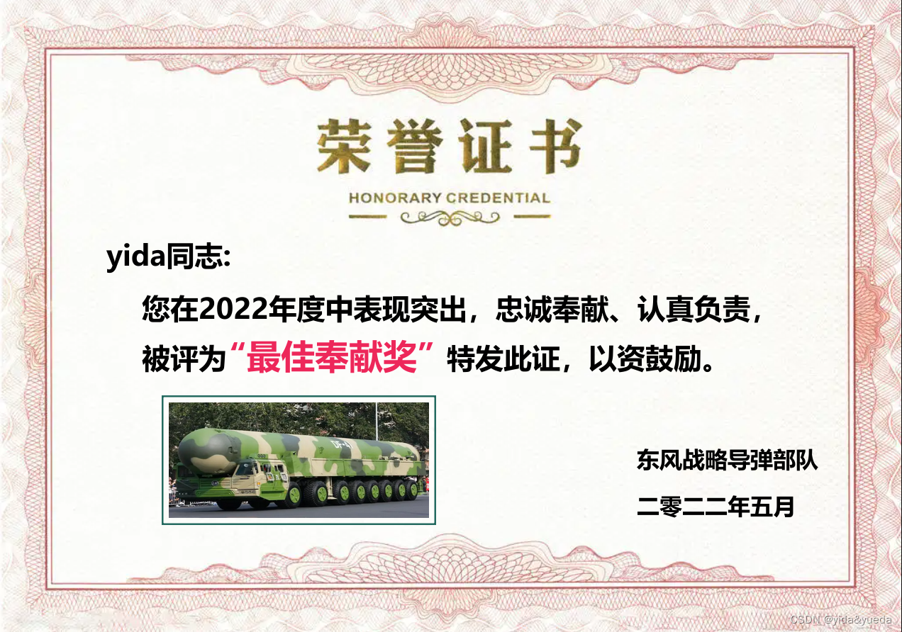
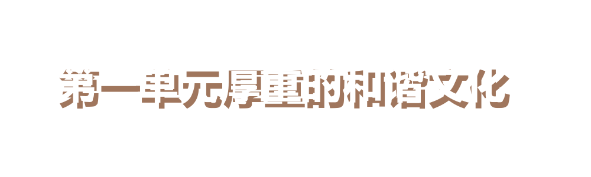

# golang 文字转图片 艺术字生成 两个图片叠加

## 1 文字贴图 图片叠加 效果：dst.png

- go mod tidy
- go mod vendor
- go run main.go

## 2 重叠效果 效果：dst-2.png

- go run main-2.go

### 来源

- https://blog.csdn.net/qq_40585384/article/details/124762939
